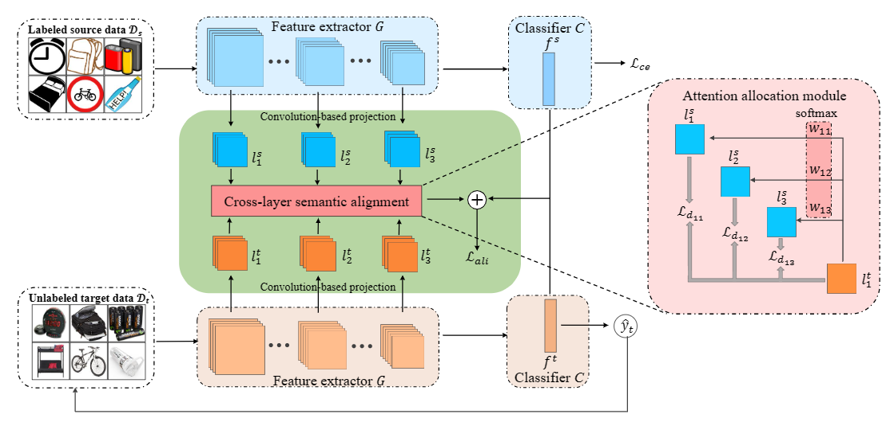

# Attention-based Cross-Layer Semantic Alignment for Unsupervised DomainAdaptation

### Introduction
This repository is for our paper "Attention-based Cross-Layer Semantic Alignment for Unsupervised DomainAdaptation" \[Neurocomputing 2022\]



### run
1. Prepare the config file in `./src/experiments/config`

2. Run the script
```bash
cd src/experiments/scripts
bash train.sh
```

### Acknowledgement
Some of the code is borrowed from [CAN](https://github.com/kgl-prml/Contrastive-Adaptation-Network-for-Unsupervised-Domain-Adaptation).
